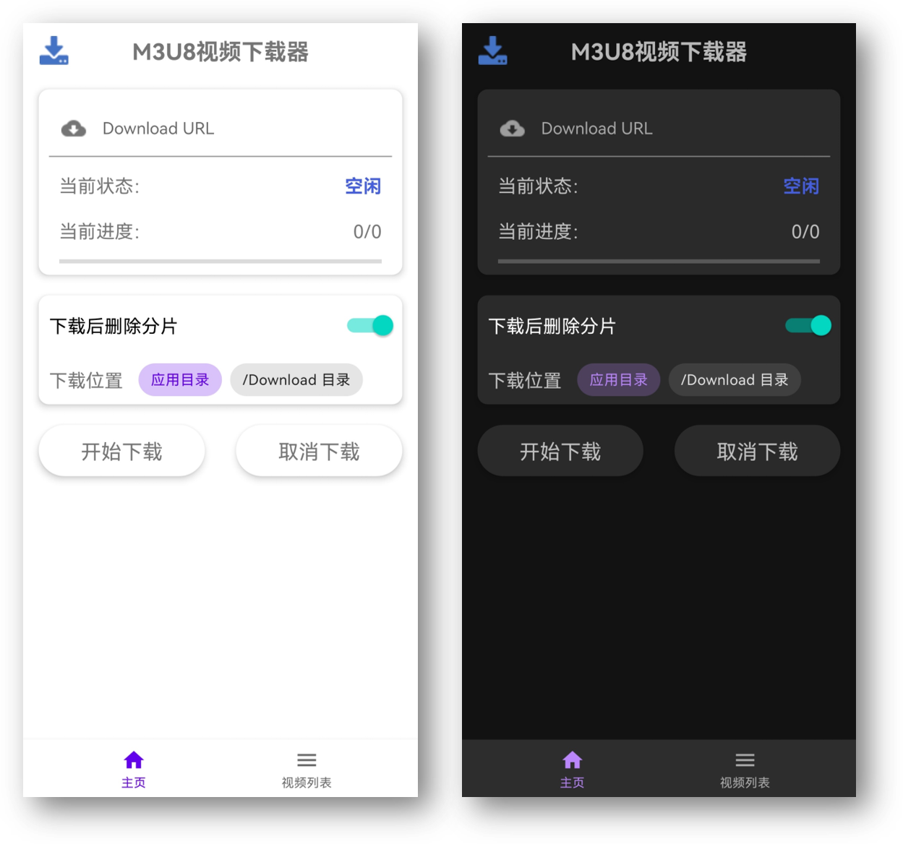
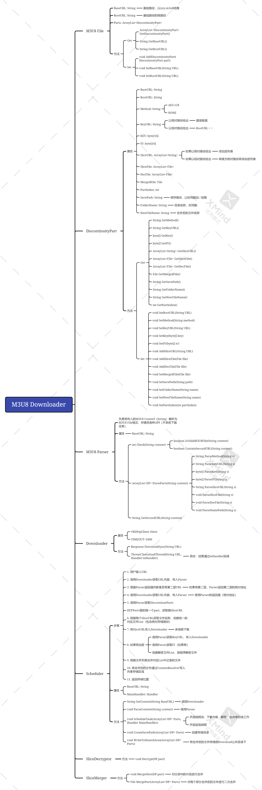
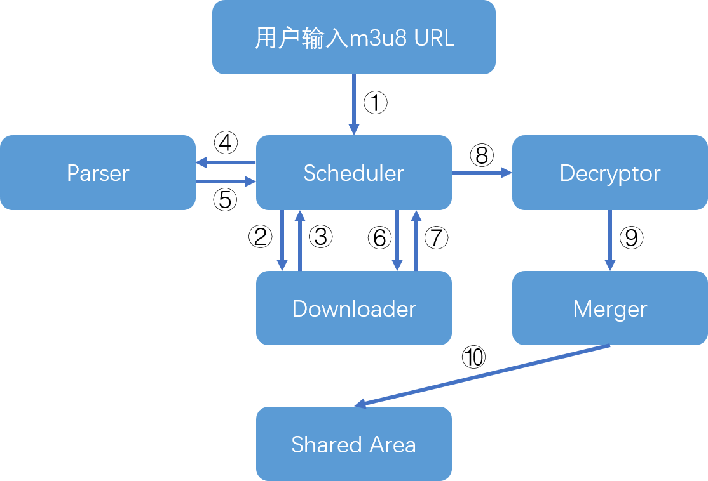

# M3U8Downloader_Android

## 1. 介绍

- 这是一款个人开发的适用于Android平台的m3u8视频下载器。

## 2. 说明

> 1. 此分支（remaster_kt）是使用Kotlin重写main分支后的作品，大幅减少了代码体积。
> 2. 目前发布的release可能存在奇怪的bug，仅供学习和研究。
> 3. 最低支持Android版本为8.0，建议10.0（10.0以下对于Download目录的写入暂未实现）

## 3. 更新记录

### 版本1.61

1. 修复列表新增视频后坐标未更新的bug
2. 新增隐私保护，在未解锁状态不能直接跳转播放视频
3. 调整视频下载完成时间的提示

### 版本1.6

1. 新增下载完成后视频列表自动刷新（尝试使用ViewModel）
2. 调整视频列表排序逻辑，现在最新下载的视频排在顶端
3. 现在视频列表刷新后会自动滚动到顶端
4. 替换顶部ToolBar的图标
5. 调整顶部ToolBar的层级结构，现在ToolBar在两个页面均会出现
6. 调整底部BottomNavgationView菜单子项的颜色

### 版本1.51

1. 调整各个界面中卡片和两侧的外边距，更适合全面屏
2. 调整视频列表中每个条目的主标题显示内容，现在直观显示下载时间
3. 修复下载中途取消下载会删除整个视频目录的bug
4. 修复由于视频列表Fragment不重载导致新添加的项目无法显示
5. 新增视频列表下拉刷新功能

### 版本1.5

1. 新增解析同一视频源的多码率文件时，自动选择最高码率/清晰度功能
2. 调整保存位置的选择，现在只可保存到应用目录或Download目录

### 版本1.43

1. 修复了合并后的视频播放异常的问题
2. 使用Kotlin File I/O新特性重新实现分片合并

### 版本1.41

1. 新增自定义下载线程数量（范围2~8）
2. 微调主界面UI颜色和布局

> 注：以下为java版更新内容，kotlin版从此处继续完善，java版不再更新

### 版本1.4 Beta更新：

1. 更新了主界面显示，移除不必要功能
2. 新增可选择下载文件保存位置

### 版本1.31 Beta更新：

1. 增加了视频列表的排序
2. 增加了已下载文件距今的时间显示

### 版本1.3 Beta更新：

1. 视频列表由ListView升级为RecyclerView
2. 更新视频列表的视觉效果
3. 支持在软件内对视频进行删除

ps: 正在计划使用kotlin重写整个项目

### 版本1.2 Beta更新：

1. 新增URL输入合法性检测
2. 新增视频分片多次下载超时则下载失败机制
3. JDK版本由1.8升级为11
4. Gradle版本升级为7.0
5. 下载器请求Header部分新增UA设定
6. 新增底部导航栏、已下载视频列表页面
7. 现在可通过视频列表页直接跳转至视频播放器播放

### 版本1.1 Beta更新：

1. 新增下载过程中取消下载的功能
2. 调整界面布局
3. 调整”开始下载“按钮位置

### 版本1.0 Beta更新：

1. 重构软件整体架构，逻辑更清晰，大幅提升运行效率
2. 新增程序架构图、程序流程图

### 版本0.2更新：

1. 适配Android 10及以上的暗色模式
2. 新增应用程序图标

## 4. 程序运行截图

## 5. 程序整体架构图

## 6. 程序运行流程图

> 1. 将用户输入的m3u8 URL传入Scheduler；
> 2. Scheduler向Downloader传递URL；
> 3. Downloader获取m3u8内容并返回给Scheduler；
> 4. Scheduler将内容传递给Parser，解析各部分具体内容（详见架构图）
> 5. Parser返回解析结果（Part列表）给Scheduler；
> 6. Scheduler开启下载线程池，根据结果下载视频分片；
> 7. Downloader回报下载内容，Scheduler写入存储；
> 8. （如有加密）Scheduler调用Decryptor进行解密；
> 9. Scheduler调用Merger将分片内容合并；
> 10. Scheduler将合并后的MP4文件写入共享存储区域；